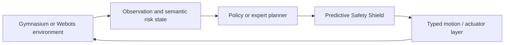

# RiskAware Safe-RL Construction Inspector

Risk-aware autonomous inspection for simulated construction sites. The project
combines semantic risk representations, constrained reinforcement learning,
predictive action shielding, and reproducible Webots execution under uncertain
perception.

## Project overview

Construction inspection requires useful coverage without entering restricted
areas, approaching workers, or accepting avoidable collision and near-miss
risk. This repository provides a Gymnasium benchmark, expert and learned
baselines, a predictive Safety Shield, controlled uncertainty experiments, and
an integrated Webots demonstration.

The central research method is **RiskShield-PPO**: PPO with a Lagrangian cost
signal, an auxiliary cost-value estimator, and a runtime shield that can reject
or replace an unsafe proposal before motor execution.

## Key capabilities

| Capability | Implementation evidence |
| --- | --- |
| Risk-aware navigation | A*, frontier exploration, PPO, SAC, and RiskShield-PPO baselines |
| Semantic risk state | Typed map channels for hazards, workers, restrictions, PPE risk, and visibility |
| Predictive safety | Shielded action selection with cost, near-miss, and collision checks |
| Uncertainty evaluation | Seeded perception perturbations and a 320-episode uncertainty suite |
| Runtime validation | Webots controllers, structured traces, fixtures, and safety tests |
| Experimental extension | Hierarchical v4 target persistence and local planning pipeline |

## Production and experimental status

**Primary / production research method: RiskShield-PPO v1.** It remains the
baseline used for the principal research claims.

**Experimental extension: Hierarchical v4.** The hierarchical system is
retained for research and runtime investigation; it does **not** replace or
promote itself over RiskShield-PPO v1.

## System architecture



The v1 path is the primary constrained-policy baseline. The v4 experimental
path adds hierarchical options, persistent targets, incremental planning, and
local primitive control before the same safety-and-actuator boundary.

## Repository structure

```text
configs/    Reproducible benchmark, policy, perception, and curriculum configs
docs/       Method, safety, completion, and demonstration documentation
paper/      LaTeX source, tables, figures, bibliography, and compiled PDF
reports/    Canonical results, manifests, validation, and release evidence
scripts/    Training, evaluation, validation, and Webots entry points
src/        Python package and research environments
tests/      Unit, integration, safety, and runtime-contract tests
webots/     Worlds and robot/supervisor controllers
```

## Installation

The project targets Python 3.11 on Windows and Webots R2025a for the rendered
runtime. A CUDA-capable PyTorch installation is useful for the optional vision
path; the core tests do not require a GPU.

```powershell
py -3.11 -m venv .venv
.\.venv\Scripts\python.exe -m pip install --upgrade pip
.\.venv\Scripts\python.exe -m pip install -e ".[dev,vision]"
```

The v4 Webots robot uses `webots/controllers/hierarchical_experimental_robot/runtime.ini`
to select the checkout's project virtual environment. Webots requires a
Windows absolute interpreter command there; when cloning elsewhere, update
that one local command to the new checkout's `.venv\Scripts\python.exe`.
Large checkpoints and datasets remain outside Git; see [MODEL_CARD.md](MODEL_CARD.md)
and [DATA_CARD.md](DATA_CARD.md) for provenance and expected artifacts.

## Quick start: final Webots demo

The canonical visible demonstration is the experimental v4 runtime:

```powershell
powershell.exe -NoProfile -ExecutionPolicy Bypass `
  -File .\scripts\run_real_v4_webots_demo.ps1 `
  -World site_dynamic `
  -RunMode until_closed `
  -CameraMode overview `
  -ScenarioSeed 42 `
  -PolicyMode stochastic `
  -PolicyTemperature 0.70
```

The final visualization is a static **site-centered overview / bird's-eye
view**. It keeps the construction slab, obstacles, structures, and robot in
one usable Webots viewport while the robot navigates autonomously.

For the production integration workflow, see
[`scripts/run_complete_autonomous_inspection.ps1`](scripts/run_complete_autonomous_inspection.ps1)
and [`docs/final_demo.md`](docs/final_demo.md).

## Methods

- **RiskShield-PPO v1:** constrained PPO training plus a predictive runtime
  shield and typed action/motor boundary.
- **Expert baselines:** risk-aware A* and frontier exploration provide
  interpretable long-horizon references.
- **Learned baselines:** PPO and SAC are evaluated under the same benchmark
  protocol.
- **Hierarchical v4:** an experimental recurrent option/target layer, local
  risk-aware planner, controller, recovery logic, and shielded primitives.

The full formulation and implementation details are in
[`paper/main.tex`](paper/main.tex).

## Experimental evaluation

The canonical primary benchmark contains 1,350 unique episodes: three site
sizes, three hazard densities, three perception-noise levels, five algorithms,
and ten paired seeds. Six ablations add 180 episodes. The uncertainty suite
contains 320 episodes across 64 seeded conditions. These counts and all
summary values are recorded in `reports/final_submission/` and the paper
tables.

## Representative primary results

Means below are taken from the canonical 1,350-episode summary; success is
complete-mission success.

| Method | Hazard recall | Coverage | Safety cost | Collision rate | Success |
| --- | ---: | ---: | ---: | ---: | ---: |
| PPO | 0.0834 | 0.0090 | 49.3852 | 0.0741 | 0.0000 |
| RiskShield-PPO | 0.1466 | 0.0275 | 17.1296 | 0.0000 | 0.0000 |
| SAC | 0.1339 | 0.0744 | 150.8556 | 0.7963 | 0.0000 |
| Frontier exploration | 0.9978 | 0.5487 | 4.0111 | 0.0000 | 0.9667 |
| Risk-aware A* | 1.0000 | 0.1976 | 2.2500 | 0.0000 | 1.0000 |

The results are intentionally not presented as an RL victory over planners.
RiskShield-PPO improves PPO's observed safety cost and collision rate, while
the planners remain stronger on complete mission success in this benchmark.

## Webots demo

The user-facing v4 scene uses the approved static overview camera. The robot
controller, supervisor, worker, safety pipeline, and runtime evidence remain
separate from visualization. Interactive Webots validation is the authority
for the final rendered appearance; automated Qt smoke tests are not treated as
visual acceptance.

## Testing and validation

The released tree has 369 passing tests. Re-run the lightweight gates with:

```powershell
.\.venv\Scripts\python.exe -m ruff check .
.\.venv\Scripts\python.exe -m ruff format --check .
.\.venv\Scripts\python.exe -m compileall src scripts webots/controllers
.\.venv\Scripts\python.exe -m pytest -q
.\.venv\Scripts\python.exe -m pip check
```

## Paper

- [Compiled paper](paper/main.pdf)
- [LaTeX source](paper/main.tex)
- [Bibliography](paper/references.bib)

The paper reports both positive and negative findings, including the limited
mission success of learned policies and the experimental status of v4.

## Reproducibility

Configurations, seeds, source tables, manifests, tests, and canonical result
summaries are version-controlled. Large datasets, model checkpoints, and
generated runtime workspaces are intentionally kept local and documented by
their cards/manifests; a fresh checkout therefore requires those external
artifacts only for workflows that depend on them.

## Limitations

- Results are simulation-only and do not establish real-world safety.
- Learned policies did not complete missions in the primary benchmark.
- The Safety Shield is model-based and can fail under unmodeled dynamics.
- The hierarchical v4 system is experimental, not a production replacement.
- The perception checkpoint supports a recorded class list; some tested
  semantic layers use simulator truth.
- Runtime evidence is bounded and configuration-specific.

## Citation

The paper is currently an unpublished repository manuscript. Cite the author
and title without inventing a venue, DOI, or publication identifier:

```bibtex
@misc{maher_riskaware_saferrl,
  author = {Mahmoud Maher},
  title = {RiskShield-Hierarchical HRMPPO-MPC: Causal Hierarchical Safe Reinforcement Learning for Construction-Site Inspection under Perception Uncertainty},
  note = {Unpublished research manuscript and software repository}
}
```

## License

The software is released under the [MIT License](LICENSE). Model and dataset
artifacts may have separate terms; consult their accompanying cards.
