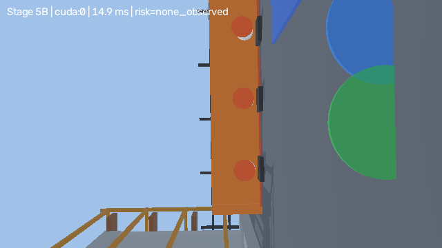

# RiskAware-SafeRL Construction Inspector

A research-oriented reinforcement learning project for autonomous inspection of dynamic construction sites.

## Research question

Can semantic risk observations, constrained objectives, and action shielding improve hazard discovery while reducing collisions, worker near-misses, and restricted-zone violations?

## Current stage

- [x] Reproducible Python project
- [x] Gymnasium construction-inspection benchmark
- [x] Explicit safety cost signals
- [x] Random-policy baseline
- [x] PPO baseline
- [x] Rule-based action shield
- [x] Unit tests and GitHub Actions
- [ ] PPO-Lagrangian
- [x] Expert A* baselines with deterministic tie-breaking
- [ ] Partial-observation recurrent agent training and evaluation (GRU module and reset tests exist)
- [x] Webots Stage 5A camera and deterministic Stage 5A3 closed-loop validation
- [x] Production PPE perception model with verified CUDA inference
- [x] Deterministic domain-randomization sampler
- [x] Stage 5B3 controller-synchronized live perception and verified first-person viewport
- [x] Stage 5C MaskablePPO-to-SafetyShield-to-Webots motor runtime
- [ ] Full benchmark and research paper

## Environment

The agent operates in a partially observable grid construction site.

Actions:

- `0`: move up
- `1`: move down
- `2`: move left
- `3`: move right
- `4`: inspect the current cell

Observation channels:

1. obstacles
2. hazards
3. workers
4. restricted zones
5. visited cells
6. agent position
7. semantic risk map

Safety costs:

- collision cost
- worker near-miss cost
- restricted-zone cost

## Setup

```powershell
.\.venv\Scripts\python.exe scripts\check_env.py
.\.venv\Scripts\python.exe scripts\evaluate_random.py --episodes 20
.\.venv\Scripts\python.exe scripts\train_ppo.py --timesteps 100000 --device cuda
.\.venv\Scripts\python.exe scripts\train_ppo.py --timesteps 100000 --device cuda --shield
powershell -NoProfile -ExecutionPolicy Bypass -File scripts\run_stage5a3_closed_loop_mission.ps1 -Mode Validation
powershell -NoProfile -ExecutionPolicy Bypass -File scripts\run_complete_autonomous_inspection.ps1
```

## Tests

```powershell
.\.venv\Scripts\python.exe -m pytest
```

## TensorBoard

```powershell
.\.venv\Scripts\tensorboard.exe --logdir artifacts\tensorboard
```

## Repository policy

Generated datasets, model checkpoints, and experiment logs are ignored by Git. Only code, configs, documentation, and small reproducibility artifacts should be committed.

## Verified Webots control boundaries

Stage 5A validates scripted 640 x 360 camera acquisition. Stage 5A3 validates a deterministic GPS/compass closed-loop waypoint controller. Neither stage uses CV detections or an RL policy to control motors. The repository does not establish real-world safety and makes no absolute safety guarantee.

Stage 5C is a separate bounded runtime. It loads the verified MaskablePPO checkpoint, applies task-valid masks and the runtime SafetyShield, converts the executed action to differential-drive commands, and sends those commands to the Webots wheel motors. Live CUDA perception updates the semantic risk observation before policy inference. The accepted Stage 5C run used neither manual control nor a fallback controller.

<!-- STAGE5B4_FINAL_SHOWCASE -->

## Final stabilized camera showcase

The permanent camera skew was removed, and the verified Stage 5B3
mission now produces a repository-ready CUDA perception demonstration.



The Stage 5B showcase motor source remains the closed-loop waypoint controller.
The separate Stage 5C runtime is the only accepted RL motor-control path.
No collision-free or real-world safety claim is made.
