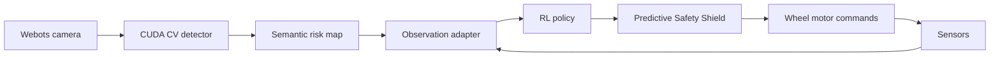

# RiskAware-SafeRL Construction Inspector

RiskAware-SafeRL is a reproducible simulation research project for autonomous
construction-site inspection under safety constraints and perception
uncertainty.

## Objective and contribution

The project separates task reward from safety cost and compares expert
planners, PPO, SAC, and RiskShield-PPO. RiskShield-PPO is PPO-Lagrangian with an
auxiliary cost-value estimator; it is not renamed ordinary PPO. A predictive
Safety Shield can replace an unsafe proposal before the final Webots wheel
command. Live CUDA perception updates the semantic risk state.



## Verified capabilities

- Deterministic Gymnasium research environment with semantic channels, dynamic
  hazards, workers, restricted zones, PPE risks, masks, reward, and safety cost.
- Risk-aware A*, frontier exploration, and nearest-risk revisit planners.
- Genuine PPO, SAC, and RiskShield-PPO checkpoints with hashes and metadata.
- Three validated Webots R2025a worlds with level first-person rendering.
- Live 14-class CV checkpoint inference on CUDA and semantic state changes.
- 320 uncertainty episodes across 64 controlled conditions.
- 1,350 unique primary benchmark episodes, 180 ablations, statistics, figures,
  and source data.
- Stage 5C evidence that policy proposals pass through the Safety Shield and
  reach Webots wheel commands without manual or fallback control.

## Honest limitations

PPO, SAC, and RiskShield-PPO achieved zero complete-mission success in the final
grid benchmark. RiskShield-PPO reduced PPO's mean safety cost from 49.39 to
17.13 but its multiplier saturated. Validation is simulation-only and bounded;
the detector class list is limited; no recurrent checkpoint exists; and no
real-world safety guarantee is made.

## Installation

Requirements: Windows 10/11, Python 3.11, Webots R2025a, and an NVIDIA GPU for
the accepted CUDA runtime.

```powershell
py -3.11 -m venv .venv
.\.venv\Scripts\python.exe -m pip install --upgrade pip
.\.venv\Scripts\python.exe -m pip install -e ".[dev,vision]"
.\.venv\Scripts\python.exe -c "import torch; print(torch.cuda.is_available())"
```

Large checkpoints and datasets remain outside Git. Their expected paths and
hashes are documented in [MODEL_CARD.md](MODEL_CARD.md) and
[DATA_CARD.md](DATA_CARD.md).

## One-command runtime

```powershell
powershell.exe -NoProfile -ExecutionPolicy Bypass `
  -File "F:\AI\My_Project\RiskAware-SafeRL-Construction-Inspector\scripts\run_complete_autonomous_inspection.ps1"
```

## One-command benchmark

```powershell
powershell.exe -NoProfile -ExecutionPolicy Bypass `
  -File "F:\AI\My_Project\RiskAware-SafeRL-Construction-Inspector\scripts\run_full_research_benchmark.ps1"
```

## Final acceptance

```powershell
powershell.exe -NoProfile -ExecutionPolicy Bypass `
  -File "F:\AI\My_Project\RiskAware-SafeRL-Construction-Inspector\scripts\run_final_acceptance.ps1"
```

## Tests

```powershell
.\.venv\Scripts\python.exe -m compileall -q src scripts tests
.\.venv\Scripts\python.exe -m ruff format --check .
.\.venv\Scripts\python.exe -m ruff check .
.\.venv\Scripts\python.exe -m pytest
```

## Results

Frontier exploration achieved 0.967 success and 0.998 hazard recall. Risk-aware
A* achieved 1.0 success and recall with lower coverage. Full metrics,
confidence intervals, and ablations are in
`reports/final_submission/stage9_benchmark`.

## Paper and repository

The compiled paper is [paper/main.pdf](paper/main.pdf). Architecture,
methodology, reproducibility, demo, and troubleshooting guides are under
`docs/`. Source code is under `src/riskaware_saferrl`, entry points under
`scripts/`, Webots assets under `webots/`, configurations under `configs/`,
tests under `tests/`, and evidence under `reports/`.

## Citation and license

Use [CITATION.cff](CITATION.cff) for citation metadata. The software is
available under the [MIT License](LICENSE); dataset and model licenses must be
checked separately as documented in the cards.
# Final research-release status

RiskShield-PPO v1 remains the production policy. The recurrent hierarchical
HRMPPO-MPC v4 system is an experimental research policy and is not approved to
replace v1. The repository preserves the H3/H4 negative results, the causal
datasets, production Webots evidence, and the historical 1,350-run benchmark.
An additional 270 held-out hierarchical grid episodes are generated by
`scripts/run_hierarchical_benchmark_v2.py`; combined benchmark outputs are
written under `reports/strong_policy_upgrade/benchmark_v2/`. Independent
labeled CV mAP evidence is unavailable, so the verified 14-class checkpoint is
retained without invented metrics.
