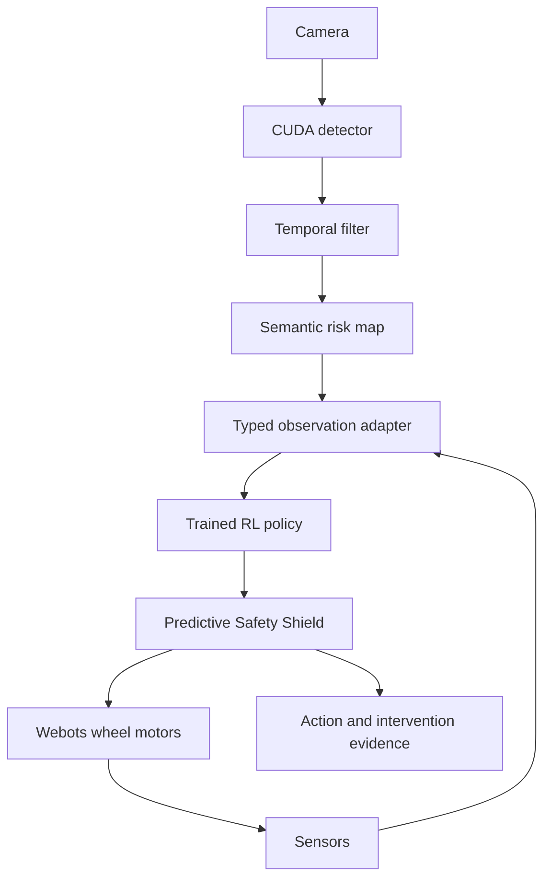

# Final System Architecture

The research grid benchmark and Webots runtime share observation, risk, and
safety concepts but are separate evaluation domains. Planner actions are never
labeled RL. Simulator truth is labeled separately from CUDA detections.
